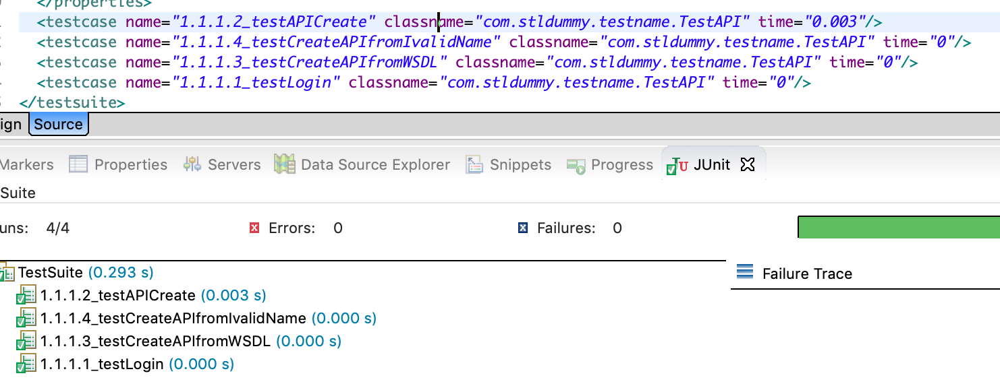

# README

## TestNG Test case name customization during runtime 
**Note: Changes will be appeared in TEST-TestSuite.xml**
### 1. Append description to the test case name
Requirement: User wants to customize testcase name as using own @Test attributes

> *Test attributes are @Test specific, and are to be specified right next to the @Test annotation*

ex:- description, dependsOnMethods, groups

Methodology:
Here org.testng.ITest interface is implement to change the test case name. Then @BeforeMethod is used to change the test case name dynamically before each Test method.

Sample code snipt...
```java
...
        @Test(description="1.1.1.1")
    	public void testLogin()
    	{
       		Assert.assertTrue(true);
       
    	}

	@BeforeMethod(alwaysRun = true)
        public void changeTestCaseName(Method method) {
		testInstanceName = method.getAnnotation(Test.class).description() + "_" + method.getName();
        }

	public String getTestName() {
		return testInstanceName;
	}
...
```
Results:


You can find the complete source from [HERE](https://github.com/chaminda/TestCaseNameChangeDummy/blob/master/src/test/java/com/stldummy/testname/TestAPI.java).

### 2. Append DataProvider values to the test case name

Requirement: When some tests are run with DataProvider, in the report, same test method name will be appeared multiple times on all the values of DataProvider.
So user wants to differentiate each test instances in the results(EST-TestSuite.xml). 

Methodology:
Here also we use the same method we used in above example. Additionally we append an value from DataProvider.

```Java
	@BeforeMethod(alwaysRun = true)
        public void changeTestCaseName(Method method) {
                testInstanceName = method.getAnnotation(Test.class).description() + "_" + method.getName() + "_" + apiName;
        }
```
Results:


You can find the complete source from [HERE](https://github.com/chaminda/TestCaseNameChangeDummy/blob/master/src/test/java/com/stldummy/testname/TestAPIDD.java)

